# **_Disney Food Guide_**

Disney Food Guide is an online guide which provides the user with easy to follow information about the top rated food, snacks and restaurants at Disney World in 2022. 

The target audience is anyone interested in visiting Disney World or finding out more information about the food and dining options. This could be anyone teen and above, male or female. It is expected that the majority of the target audience will most likely be young adults or middle aged parents with kids. 

The goal of this website is to be a comprehensive but concise guide to the best restaurants, snacks and drinks at Disney World in 2022. Information needs to be correct, fully up to date and displayed in a intuitive and user friendly way. The website will also feature clickable links to external websites to enable the user to easily book a table, view the full menu or find the location of the specific item / restaurant.

Link to the live site - [Disney Food Guide](https://matthew-hurrell.github.io/Disney-Food-Guide/)

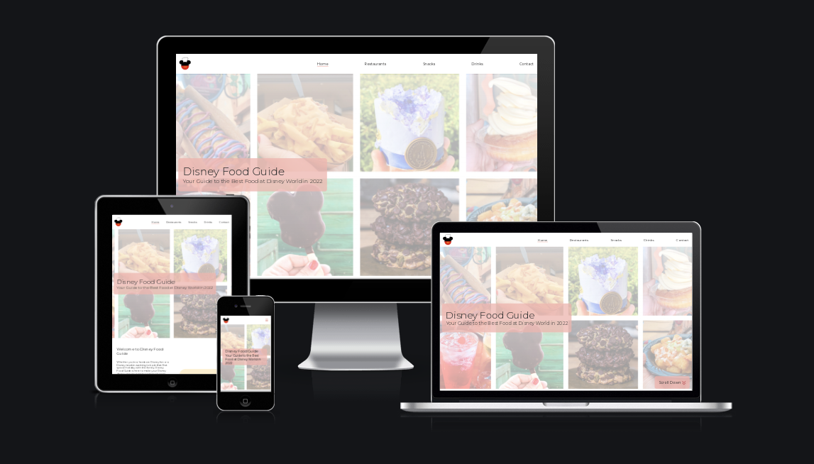

# Contents

* [**User Experience UX**](<#user-experience-ux>)
    * [User Stories](<#user-stories>)
    * [Wireframes](<#wireframes>)
    * [Site Structure](<#site-structure>)
    * [Design Choices](<#design-choices>)
    * [Typography](<#typography>)
    * [Colour Scheme](<#colour-scheme>)
* [**Features**](<#features>)
    * [**Home**](<#home>)
         * [Navigation menu](<#navigation-menu>)
         * [Main Header](<#main-header>)
         * [Introduction](<#introduction>)
         * [Mailing List](<#mailing-list>)
         * [Footer](<#footer>)
    * [**Restaurants**](<#restaurants>)
         * [Header](<#restaurant-header>)
         * [Restaurant Listings](<#restaurant-listings>)
         * [Footer](<#restaurant-footer>)
    * [**Snacks**](<#snacks>)
         * [Header](<#snacks-header>)
         * [Snack Listings](<#snack-listings>)
    * [**Drinks**](<#drinks>)
         * [Header](<#drinks-header>)
         * [Drink Listings](<#drink-listings>)
    * [**Contact**](<#contact>)
         * [Contact Background](<#contact-background>)
         * [Contact Form](<#contact-form>)
    * [**Form Submission Confirmation**](<#form-submission-confirmation>)
    * [**Future Features**](<#future-features>)
* [**Technologies Used**](<#technologies-used>)
* [**Testing**](<#testing>)
     * [**Validator Tests**](<#validator-tests>)
     * [**Responsiveness Tests**](<#responsiveness-tests>)
     * [**Lighthouse Tests**](<#lighthouse-tests>)
     * [**Browser Tests**](<#browser-tests>)
     * [**Bugs**](<#bugs>)
* [**Deployment**](<#deployment>)
     * [**Project Deployment Via GitHub**](<#project-deployment-via-github>)
     * [**How to Fork a Repository Via GitHub**](<#how-to-fork-a-repository-via-github>)  
     * [**How to Create a Local Clone of a Project**](<#how-to-create-a-local-clone-of-a-project>)   
* [**Credits**](<#credits>)
    * [**Content**](<#content>)
    * [**Media**](<#media>)
*  [**Acknowledgements**](<#acknowledgements>)

# User Experience UX

## User Stories

* As a user I want to be able to fully understand the purpose of Disney Food Guide from the main landing page.
* As a user I want the navigation to be intuitive and easy to understand, with a clear purpose and easy access to information.
* As a user I want to be able to see simple and organised lists with names, prices, descriptions and pictures of each item.
* As a user I want easy links that can lead me off page in a different tab to view the full menu and map locations of each item when applicable. 
* As a user I want to be able to sign up to a mailing list to receive further information and updates from Disney Food Guide direct to my email mailbox.
* As a user I want to be able to contact Disney Food Guide and share my own personal experience at Disney World with pictures if applicable.
* As a user I want to be able to connect with Disney Food Guide through various social media sites quickly and easily.
* As a user I want to see the top recommended restaurants, food and drink at Disney World. 
* As a user I want to be provided with a link to book a table at any of the applicable locations listed on the site.

[Back to top](<#contents>)

## Wireframes 

The project templates and wireframes for Disney Food Guide were designed using [Balsamiq](https://balsamiq.com). The designs vary from the end layout in some places due to creative decisions made throughout the development process.

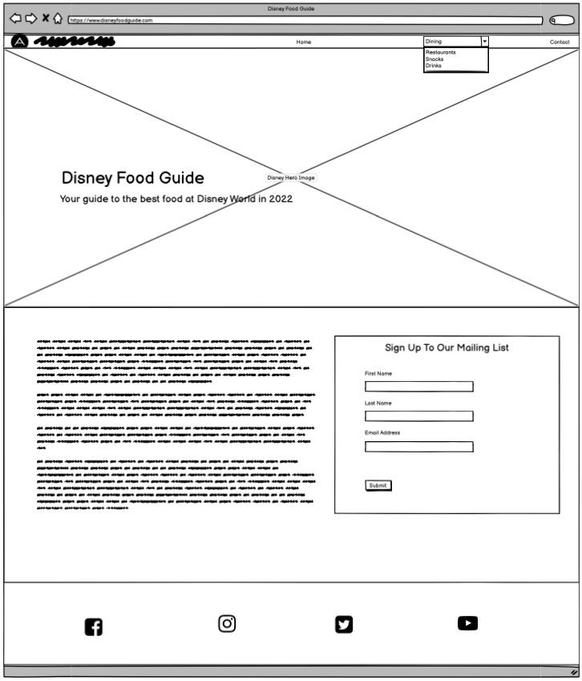

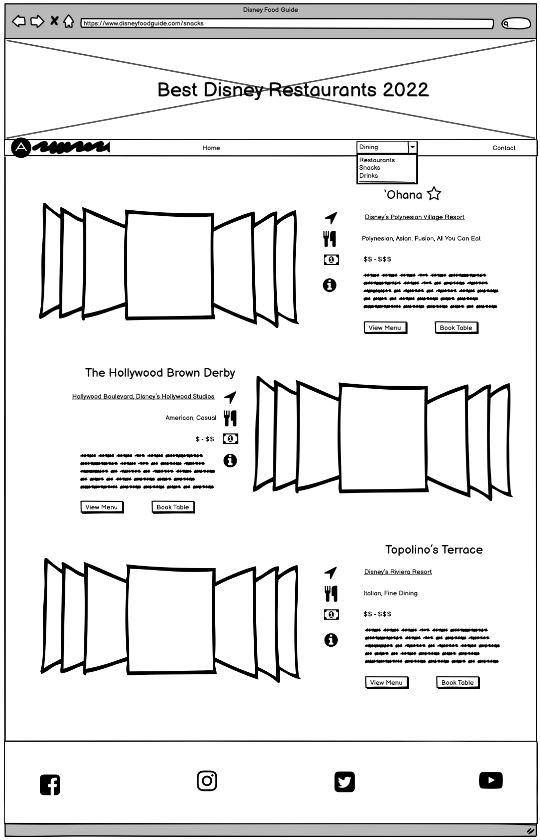

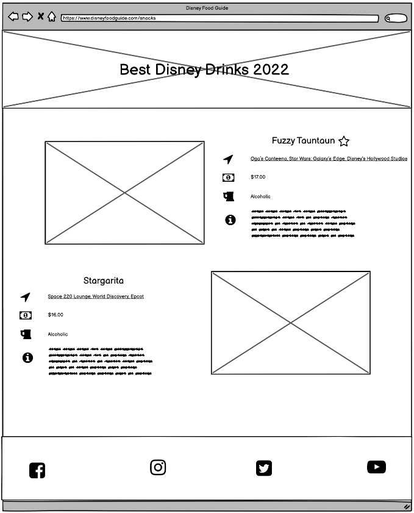

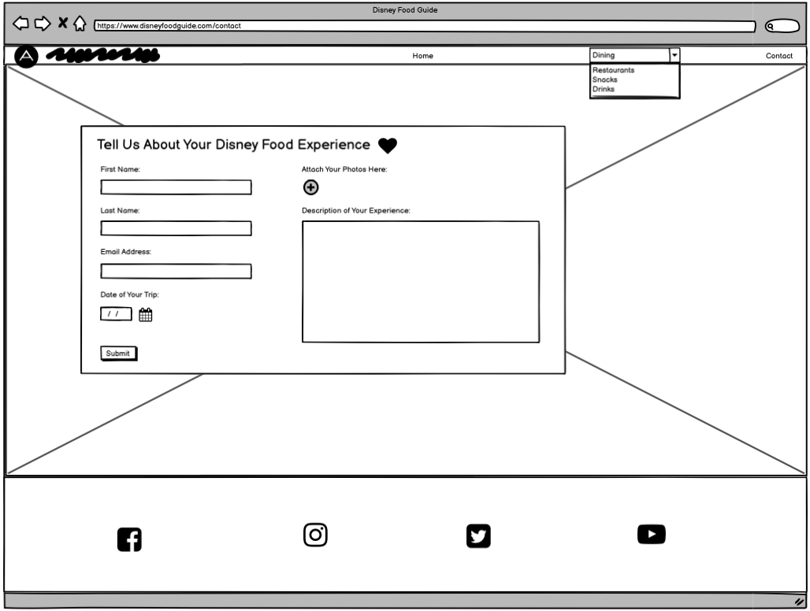

[Back to top](<#contents>)

## Site Structure 

Disney Food Guide has five pages freely accessible by using the on site navigation. These pages are the [home page](index.html), which is the default loading page, [restaurants](restaurants.html), [snacks](snacks.html), [drinks](drinks.html) and [contact](contact.html). There is one other page which is viewed in response to the contact form submission, that page is [thanks](thanks.html), but this page isn't accessible via the normal site navigation. The navigation bar is present on every page of the website. This nav is replaced by a mobile sticky nav on smaller devices, which follows the screen when the user continues down the pages. A back to the top clickable link was added to the longer pages to enable a user to scroll back up to the top of the page without having to manually scroll. This makes accessing the nav bar easier on larger screens. These links disappear on smaller devices as the nav bar is always visible. The logo at the top left of the nav bar can also be used as a link to the home page. There is also a scroll down clickable link box on the home page main header image which provides a visual queue for the user to scroll down to view the welcome text as the main header takes up the entire page. When clicked, this box scrolls the view down to the lower section. The box and contents disappears on smaller devices. 

[Back to top](<#contents>)

## Design Choices 

* ### Typography 

The font family chosen for Disney Food Guide was Montserrat, with a backup font of sans-serif. This font family was used for all text across the site. It was chosen for its professional yet playful feel which is easy to read. It matched well with the lighthearted tone of the content whilst still remaining formal enough to not look unprofessional. The font was selected from [Google Fonts](https://fonts.google.com/). To cut down on load times only font weights of 300 and 400 were chosen. The font was imported using a link in [the CSS document](assets/css/style.css).

* ### Colour Scheme 

The colour scheme used was a variation on the classic Disney colour scheme. Mostly a combination of whites, pinks, blacks and orange yellows with varying degrees of transparency to provide different shades. The text colour is a dark grey so as not to appear too dark. Social media icons transition to their signature colours when hovered over. The light colours throughout the site help to generate a soft and welcoming atmosphere. Orange is a colour of optimism, freedom and youth. Pink is a calm, soft and creative colour. Yellow is a colour often associated with fun, happiness, joy and positivity. Together these colours capture the youthful spirit of Disney. A blue background image is used for the contact page as blue is a colour of trust, confidence and purpose. This may help generate more confidence and trust in the user to submit their details. 

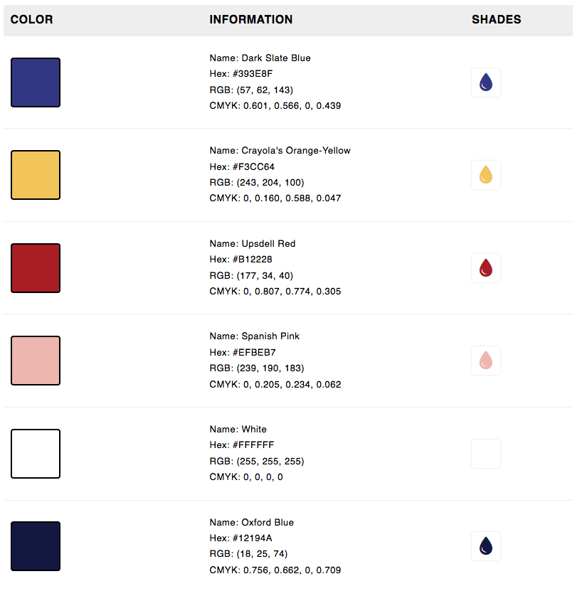

[Back to top](<#contents>)

# Features

Disney Food Guide is designed to make accessing information as easy for the user as possible. There are many user friendly features which are formatted and styled in accordance with best practice. Users will be familiar with the layout and flow of the site as it doesn't stray too far from the expected norm. Friendly and lighthearted content encourages exploration throughout the website. 

## Existing Features

### Home

The home page is the main landing page of Disney Food Guide. The intent of the landing page is to provide the user with a clear purpose for the website, and also to walk the user through some of the features before encouraging further exploration via the navigation bar.

Link to live site - [Home](https://matthew-hurrell.github.io/Disney-Food-Guide/index.html)

Link to code - [GitHub](https://github.com/Matthew-Hurrell/Disney-Food-Guide/blob/main/index.html)

* ### Navigation Menu 

* Main Nav

The main navigation bar is present at the top of all the pages of the site. It features a Disney Food Guide logo on the far left, which is a clickable link to the home page. Spanning across from the right of the nav bar is the links to the other pages of the website. When a user hovers over a link to a page a pink underline appears beneath the base of the text. When a user is on one of the pages that underline continually displays beneath the page link of whichever page they are on. The page links are evenly spaced using flexbox and respond to changes of screen size. When the screen size goes below 757px this navigation bar is hidden and is replaced with a mobile nav bar.

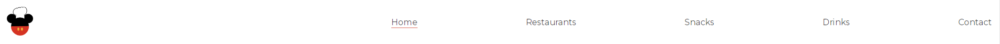

* Mobile Nav

The mobile nav bar is hidden from view on all screen sizes above 757px. On smaller screens it is visible. The mobile menu is sticky and follows the screen as the user scrolls down. This nav features the same clickable Disney Food Guide Logo on the left side of the bar. On the right side there is a menu icon button that displays a drop down menu of the page links when clicked. The menu icon is removed from display when clicked and is replaced by an icon of a cross to indicate a way of closing the menu to the user. When the cross icon is clicked the drop down menu disappears. The drop down menu doesn't interfere with the flow and layout of information displayed beneath it, it simply appears on-top until closed with the cross icon. This menu can be accessed anywhere on the page. 

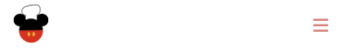

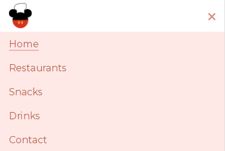

* ### Main Header

The main header section features a large background image which takes up the whole height and width of the screen on larger screens. The background image is a collage of multiple items of food and drink at Disney World. This helps the user understand the intention of the site straight away. The image features a white linear gradient which was designed through experimentation in the browser. There is also a h1 title featuring the name of the website and a h2 title below summarising its purpose. Both of these titles are within a pink slightly transparent box to make their visibility better ontop of the background image. There is also a scroll down box with similar styling and an icon with arrows pointing down. This provides a visual indication to the user that there is more information below the header. This box can also be clicked to scroll the user down to the welcome section automatically. As the screen size reduces, this section resizes at multiple break points to allow for most of the background image to still be seen. The scroll box is removed from display when the mobile nav bar is introduced and the header section is resized to the point where the information below is visible without having to scroll.

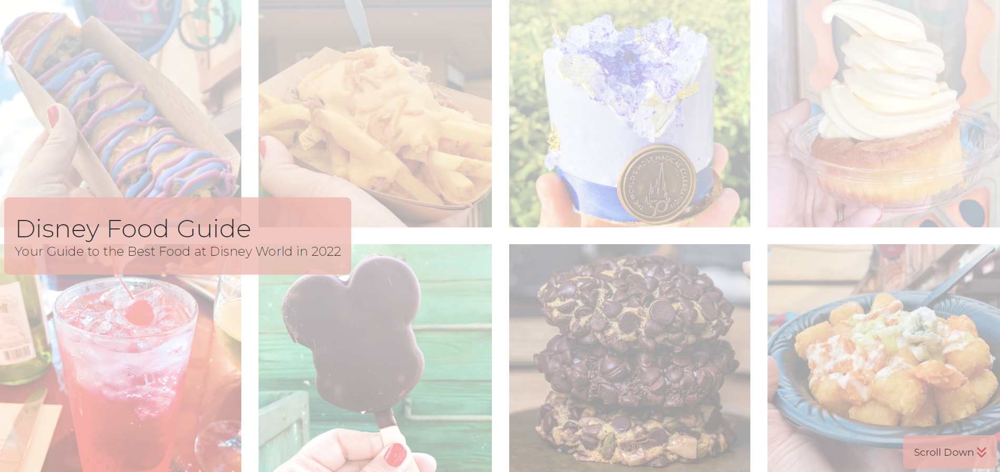

* ### Introduction

Below the header is the welcome section / introductory paragraph. It features a h2 title with a quick welcome and then a paragraph of text below that. The text further establishes the purpose and intention of the site while exhibiting the playful tone of the content. The purpose of this text is to walk the user through the basic features of the site so they have an understanding before they then use the navigation bar to travel through the sections. The text is short enough so as not to overload the user with too much information at once. 

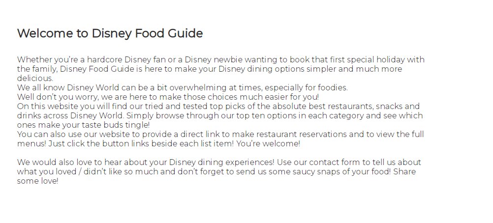

* ### Mailing List

On larger screens the mailing list is in a column directly right of the welcome paragraph. This is a form with the intention of allowing a user to submit their details to be kept informed of any further information or updates. It's a simple form with three inputs for first name, last name and email address with a submit button. There is also a h2 title within the form which displays the forms purpose to the user. The form has been formatted to not allow any of these inputs to be left blank without returning a prompt to complete the form fully. The email address input can only be submitted with a valid email address. When the information is submitted the page is simply refreshed. There are also placeholders in the input fields which are filled out with the details of Mickey Mouse. The form is responsive, and stacks beneath the welcome paragraph on smaller screens. The button changes colours when hovered over and there is a light orange background with a rounded border radius on the form. The form is an optional feature for the user.

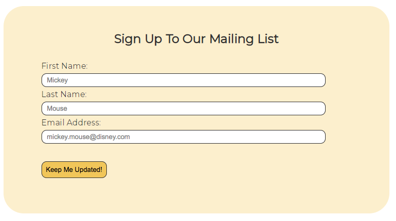

* ### Footer

The footer element is present at the bottom of every page other than the contact page. The footer has a light pink background and it contains four icons which provide links to facebook, instagram, twitter and youtube. As this site isn't established on social media, these links simply link to the home pages of each site. The icons are coloured with a darker shade of pink, but as they are hovered over by a user they transition into their predefined social media colours. A user should recognise these colours and will be able to use them as a visual queue if they are looking for a certain social media site. Generally it is quite common to see social media links in a footer so this will be something the user should be familiar with without much explanation needed. They should also be familiar with the logos without a need for writing their full names. The footer is designed using flexbox and is reponsive with smaller screen sizes and because of its simplicity, doesn't require much editing or resizing. The icons are spaced evenly across the screen using flexbox. 

[Back to top](<#contents>)

### Restaurants

The restaurants page is accessible via the main navigation menu. The intended purpose of the page is to provide the user with information about the top ten restaurants in Disney World in 2022 in a clear and easy to understand format. 

Link to live site - [Restaurants](https://matthew-hurrell.github.io/Disney-Food-Guide/restaurants.html)

Link to code - [GitHub](https://github.com/Matthew-Hurrell/Disney-Food-Guide/blob/main/restaurants.html)

* ### Restaurant Header

The header for the restaurant page features a cropped version of the background image from the main page, which makes it half the size in height. The same linear gradient is used on the image and the same styling of titles and boxing is used. The title is a h1 and is centered in the middle of the image to clearly display the subject of the page to the user. As the screen size is reduced the background image and titles continue to resize at certain break points to fit on smaller screens.

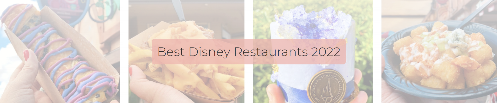

* ### Restaurant Listings

This is the main section of the restaurant page. It features ten individual restaurant listings each with a large internal picture, a name, location, dining type, price range and summary. Each listing has a button link to a menu and table booking which opens in a new tab. The location is also a link which opens a new tab to an online virtual map pinpointing the location of the restaurant. On larger screens each listing is laid out in two columns. Each listing alternates between image left and image right to give a balanced flow to the page. Each listing information section features a h2 title with the name of the restaurant at the top. The location, dining type, price range and summary then follow beneath the title with corresponding icons to easily define the purpose of each piece of information to the user clearly. Link buttons are displayed beneath the summary paragraph and feature a similar styling to other buttons throughout the site. Summary paragraph content is kept short to avoid large blocks of text. Each alternate listing features a faint change of background colours to define the different sections whilst not distracting from the content. The text is spaced using flexbox and each listing is also centered in columns using flexbox. As the screen size decreases the content shrinks before stacking on-top of each other as singular columns using the flexbox feature flex-direction: column. To reduce the amount of code and to provide a uniform appearance throughout the site, the styling of the listings is recorded using CSS classes for reusable styling throughout the other pages. Two main classes are used to style all the following listings. Content is spaced out to avoid clutter and to display information in a pleasant and easy to understand way for the user.

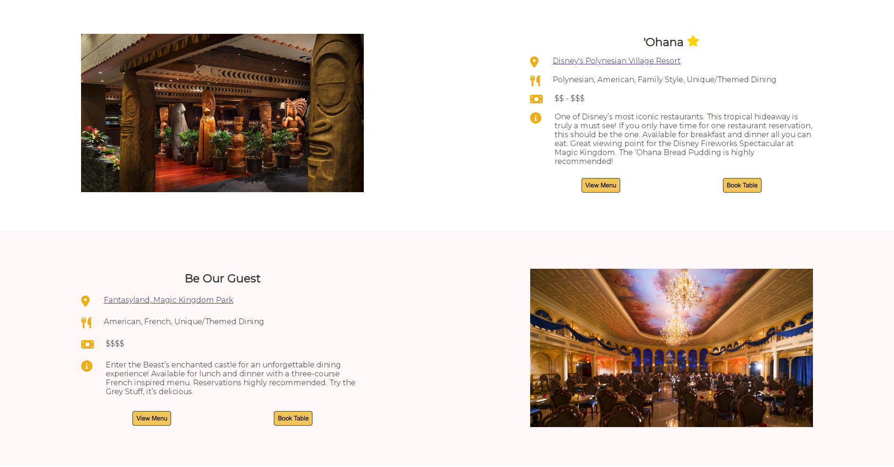

* ### Restaurant Footer

The restaurant footer is styled almost exactly the same as the footer on the main landing page, although it has one extra feature. Due to the page length, the footer also features a back to the top link, which sends the user smoothly to the top of the page when clicked. This avoids the user having to scroll manually all the way back to the top to reach the navigation bar. This link also features an arrow icon pointing upwards to serve as a visual queue if the user is unsure of its purpose. The link transitions to a darker colour when hovered over. The social media icons are then spaced evenly around the middle link using flexbox. This footer is reused for the snacks and drinks pages. The back to top link is removed from display when the mobile nav bar is visible on smaller screens. As the nav bar is sticky for the mobile display and is visible at all times, there is no need for the user to scroll to the top of the page to navigate the site. This also frees up space in the footer for responsivity on smaller screens. 

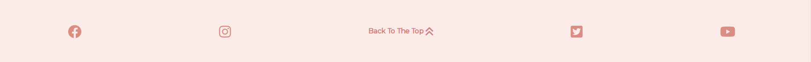

[Back to top](<#contents>)

### Snacks

The snacks page is again accessible via the main navigation menu. Its purpose is very similar to the restaurants page except it is providing information on the top ten snacks at Disney World in 2022. Information on this page needs to be arranged in a clear way for the user to understand. It should also be styled similarly to the previous pages for uniformity and professionalism. 

Link to live site - [Snacks](https://matthew-hurrell.github.io/Disney-Food-Guide/snacks.html)

Link to code - [GitHub](https://github.com/Matthew-Hurrell/Disney-Food-Guide/blob/main/snacks.html)

* ### Snacks Header

The snacks header is styled very similarly to the restaurant header except the difference in title content. This is to showcase the subject and purpose of the page to the user in a clear and defined way.

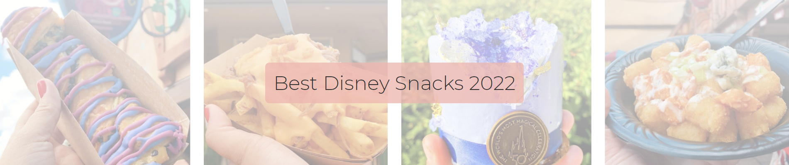

* ### Snack Listings

The main section of the snacks page is made up of the snack listings. This section comprises of ten individual listings of the top snacks at Disney World in 2022. The same reusable CSS classes from the restaurant listings are used in this section to uniformly order the images and information in a style that will now be familiar to the user. Some information used for the restaurants is inapplicable to the snacks and is removed. Snacks are normally available via couter service throughout the parks and are therefore not available for table bookings, so the booking link button was removed. The dining type was also removed as it is not relevant to the individual items. Icons and colour schemes remain consistent with the other pages of the site. Location and menu links for each item opens in a new tab. The images and information shrink on smaller screen sizes and then stack ontop of each other in singular columns using flex-direction: column. Images are kept uniform throughout with a clear front shot of each snack item per listing. 

[Back to top](<#contents>)

### Drinks

The drinks page is accessible via the main navigation menu. The purpose of this page is to define and showcase the top ten drinks at Disney World in 2022. Information is laid out in a format which is very consistent with the other pages in the site. Information should be clear and accurate, and the page should be easy to navigate. 

Link to live site - [Drinks](https://matthew-hurrell.github.io/Disney-Food-Guide/drinks.html)

Link to code - [GitHub](https://github.com/Matthew-Hurrell/Disney-Food-Guide/blob/main/drinks.html)

* ### Drinks Header

The styling for the drinks header is consistent with the previous pages. The h1 title is different to clearly display the subject of the content of the page to the user. 

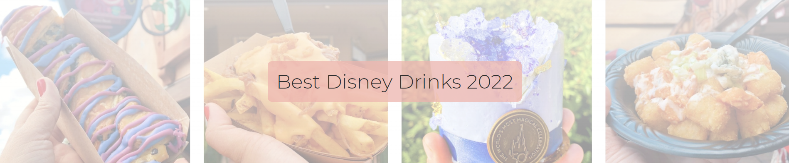

* ### Drink Listings

The main section of the drinks page is comprised of the drink listings. This section is split into ten individual listings of the top drinks at Disney World in 2022. The section uses the same reusable CSS classes from the previous pages to make the information styling consistent with previous pages. An alcoholic / non-alcoholic catagory was added to the drinks listings with a matching martini glass icon as this is a useful piece of information for users who have kids or wish to avoid alcohol. The buttons to book a table and view the menu are displayed and removed from each listing when applicable. Some drinks are only available at kiosks and consequently do not have table reservations. All buttons and location links open in a new tab. The pictures are high quality and of a similar styling to the snack images. Flexbox is used to evenly space content. As with the other pages, the listings are responsive and stack when viewed on smaller screen sizes.  

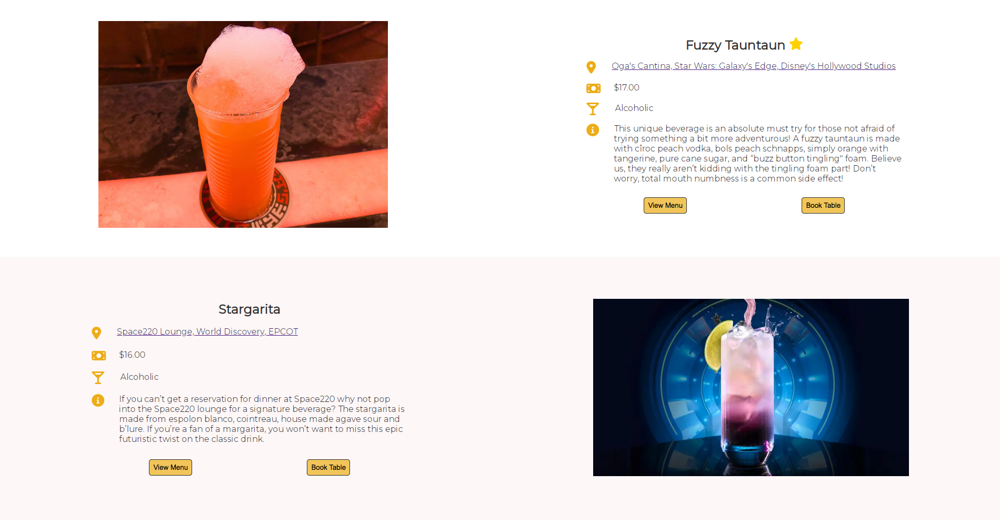

[Back to top](<#contents>)

### Contact

The purpose of the contact page is to provide a clear to understand and easily accessable form of contact that the user can use to submit details of their own experience at Disney World. Regular user interaction like this can also help keep information up to date on the website. The page needs to look welcoming and trustworthy to encourage the user to submit their information. This page is accessible via the navigation menu.

Link to live site - [Contact](https://matthew-hurrell.github.io/Disney-Food-Guide/contact.html)

Link to code - [GitHub](https://github.com/Matthew-Hurrell/Disney-Food-Guide/blob/main/contact.html)

* ### Contact Background

The contact page is a simple one form page with a centralised form and a background image covering the entire length and width of the screen. The background image dimensions are defined with vh and vw so they line up with the outer dimensions of the screen on any screen size. The background image is a simple disney themed cloud with a blue colour sky. The image is simple enough not to distract from the form content. The footer is removed from display on the contact page, however there is a linear gradient applied to the bottom of the background image which fades into the colour used for the footer throughout the rest of the site. This helps bring some consistency to the colour scheme in comparison to the other pages in the site.

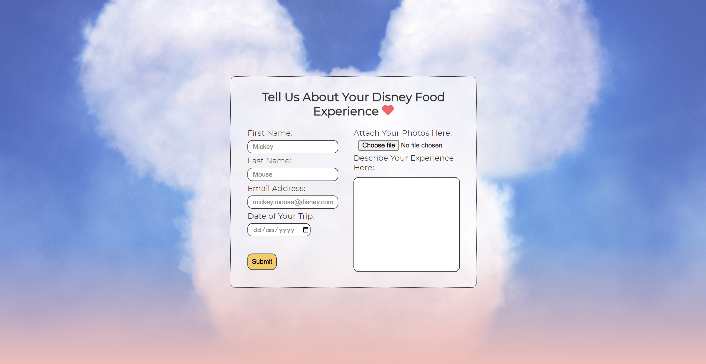

* ### Contact Form

The form on the contact page is centered in the middle of the screen using flexbox. The background is a transparent white box with a dotted 1px black border which helps provide some clarity of text over the background image. The form features a h2 title prompting the user to submit their information and details about their Disney experience. There is a heart icon in the title to encourage positive interaction. The form inputs are split into two columns on larger screens but stack into one column using flexbox on smaller screens. The user has six different inputs for information and data in the form. First name, last name, email address and the description of your trip box are all required inputs, the form will not accept the data without all of them being correctly filled out. Date of trip and the photo attachment inputs are both optional as the user may not remember a date and/or may not have a photo. The form is similarly styled to the mailing list form on the main landing page of the site. Inputs have border radius rounded edges and the same placeholders as the mailing list form. When the form is submitted the user is directed to the thanks.html page which is styled in exactly the same way but with a thank you message instead of the form. This is the only way to access the thanks.html page.

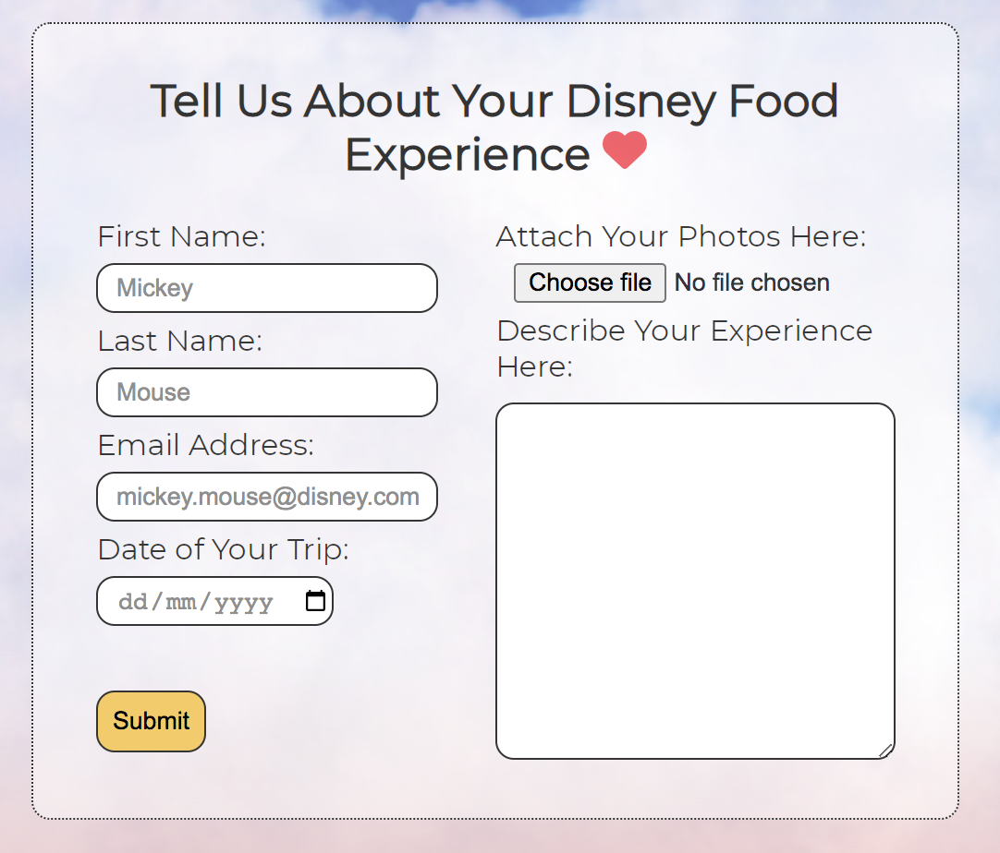

### Form Submission Confirmation

The purpose of the form submission / thank you page is to show the user that their form submission has been successfully received. The page should also allow and promote easy navigation away from the page onto another page of the site without the user needing to use the back button on the browser. This page is not accessible via the navigation menu and is hidden until the user submits the contact form. The styling and layout is exactly the same as the contact form page except the form is now removed and replaced with a thank you for your feedback message with similar styling to the form. Contact is still underlined in the navigation bar, which suggests to the user that they are still on the same page. There is also a smiley face icon next to the thank you message.

Link to live site - [Thanks](https://matthew-hurrell.github.io/Disney-Food-Guide/thanks.html)

Link to code - [GitHub](https://github.com/Matthew-Hurrell/Disney-Food-Guide/blob/main/thanks.html)

[Back to top](<#contents>)

## Future Features

Disney Food Guide has many potential avenues for expansion and improvement. Here are some ideas that could further build upon the site.

* A full blog could be added to the landing page or a seperate blog page. It would be a good place to keep users informed with the latest news and updates about the park and dining options. Further information like articles and videos could be displayed here.
* An e-commerce element could be introduced with the ability for the user to pay a small fee to download a full digital pdf dining guide for offline viewing. 
* Image elements within the lists could be further expanded by adding more images to each item to make a slideshow which the user can browse through. Video could also be included in the slideshow.
* A video guide for each category could be imbedded in the header of each page so the user can click and watch the video guide if they prefer this to reading the guide. 
* Embedded maps for each listing that don't require navigation off page would be a good feature to make finding the location easier and more user friendly. 

[Back to top](<#contents>)

# Technologies Used

* HTML5 - Provides the structure of the site information, elements and website content. 
* CSS3 - Provides the styling of the HTML content.
* Balsamiq - Wireframing software used to plan and design website templates.
* GitPod - An open source developer platform for remote development. Used to edit and build the website.
* GitHub - An online host for web and software development projects. Used to store the repository and deploy the finished website.
* Git - Software for tracking changes to files. Used with GitPod to add, commit and push code changes to the repository on GitHub. 
* Affinity Photo - A photo editing app available through the Apple store used to design and create graphics for the site.
* Apple Notes - A simple Apple app used to write and plan copy and content for the website.
* Slack - An online messaging program designed for workplace collaboration. Used for advice and guidance from peers and tutors. 

[Back to top](<#contents>)

# Testing 

## Validator Tests

Disney Food Guide has been tested extensively. All the code for every page of the site has been run through [The W3C HTML Markup Validation Service](https://validator.w3.org/) and the [The W3C CSS Markup Validation Service](https://jigsaw.w3.org/css-validator/) to test the code for any errors. On the final tests, no errors on any pages were found. 

* ### Home page

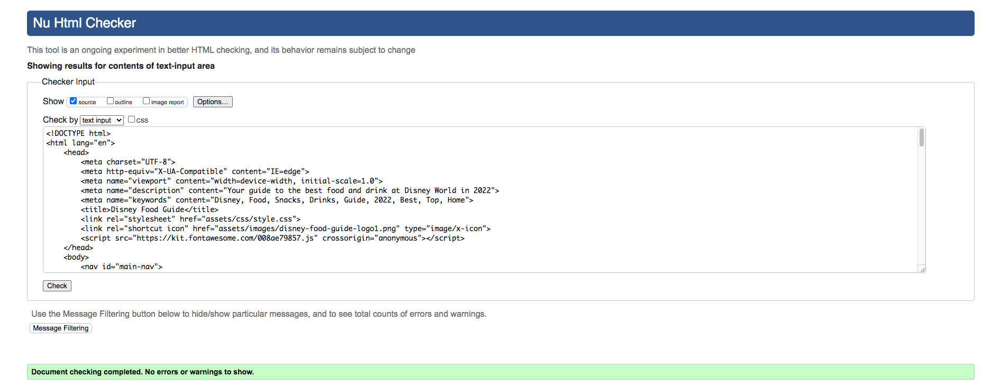

* ### Restaurants

* ### Snacks

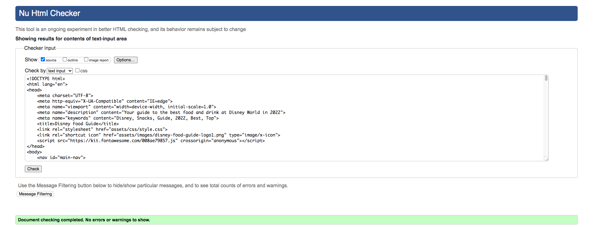

* ### Drinks

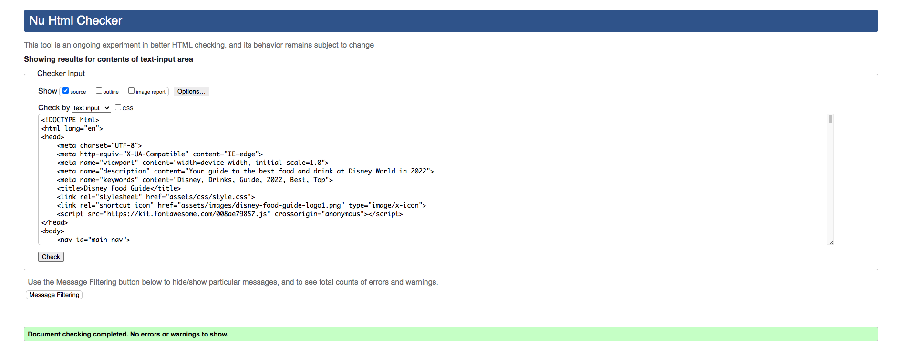

* ### Contact

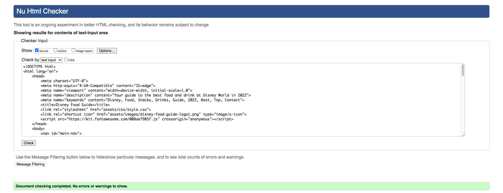

* ### Thanks

* ### Style.css

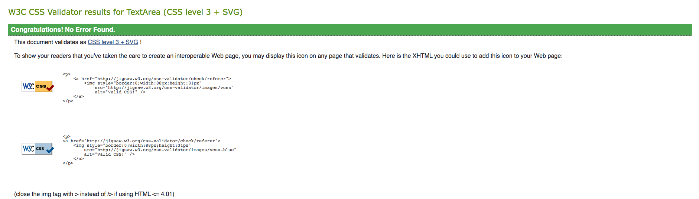

[Back to top](<#contents>)

## Responsiveness Tests

Disney Food Guide was tested thoroughly for responsiveness through multiple software applications and online resources. Most of the testing was done manually through [Chrome Developer Tools](https://developer.chrome.com/docs/devtools/) using the multiple preset device dimensions in the toolbar. Once the site layout was displaying well on every screen size, further testing was done using [Am I Responsive](https://ui.dev/amiresponsive) and [Responsive Design Checker](https://responsivedesignchecker.com/). Once the site was deployed on GitHub the link was also used to view the pages on multiple physical devices such as an Apple iPad, Apple iPhone 6, Samsung Galaxy and Apple MacBook Pro.

[Back to top](<#contents>)

## Lighthouse Tests

Disney Food Guide was also tested through [Chrome Dev Tools - Lighthouse](https://developers.google.com/web/tools/lighthouse). It was tested on four main areas - Performance, Accessibility, Best Practices and SEO. 

* ### Home page

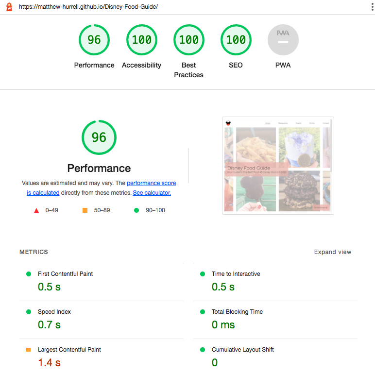

* ### Restaurants

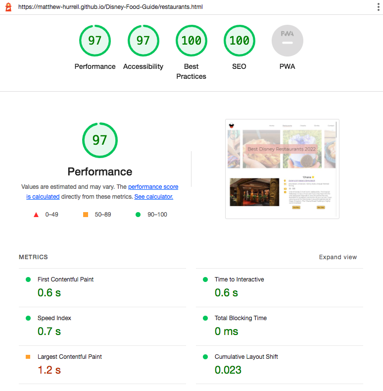

* ### Snacks

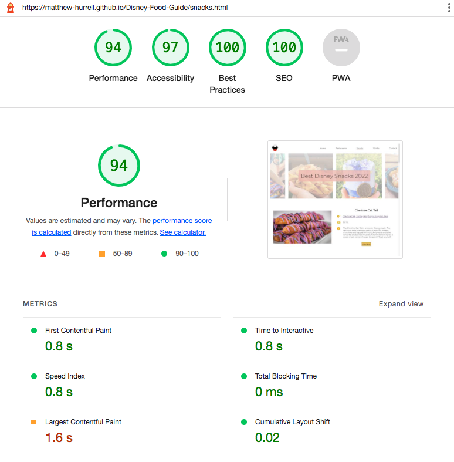

* ### Drinks

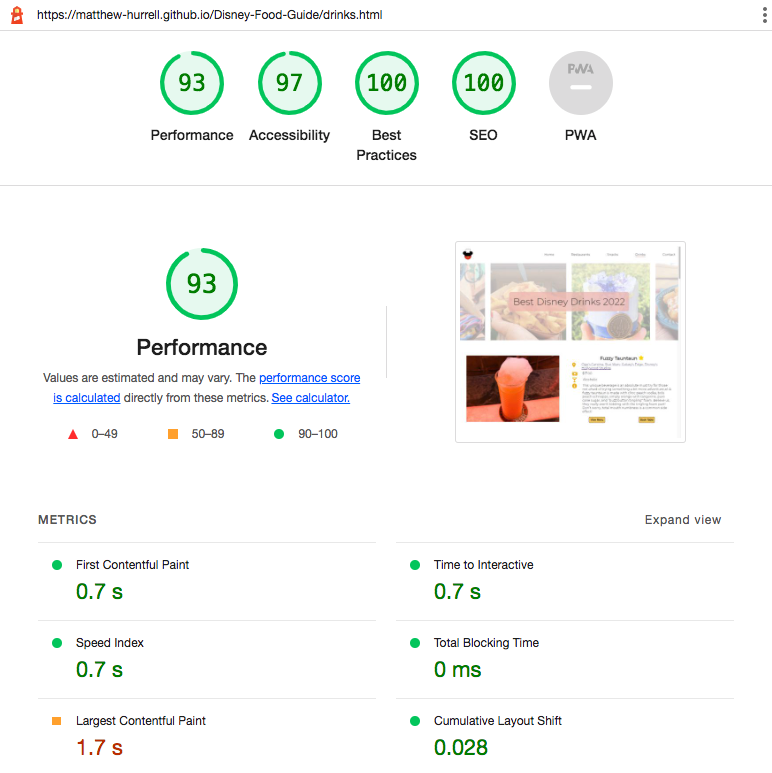

* ### Contact

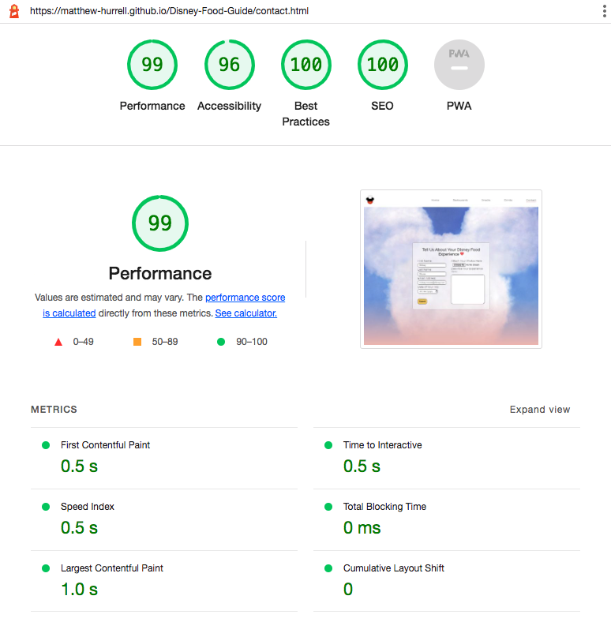

[Back to top](<#contents>)

## Browser Tests

Disney Food Guide was tested on a multitude of different browsers to check for any errors or issues. These browsers included Google Chrome, Safari and Firefox. There were no visible errors in appearance or functionality. Responsivity was also consistent. 

[Back to top](<#contents>)

## Bugs

Bugs are an inevitable part of development. Although Disney Food Guide is a relatively simple site with limited languages, there were still some bugs that occurred throughout the process. The project was built from vanilla HTML and CSS with no use of frameworks and this has its shortcomings. The lack of javascript limits functionality and interactivity of the site.

* ### Resolved 

* The first time the HTML code was submitted to W3C HTML testing it produced one main error. The testing program flagged some extra i closing tags from an icon that had been removed. This wasn't an obvious mistake as it wasn't showing up on the site or causing any problems with the display. Because the majority of the HTML was copied between pages, these bugs flagged up on the other pages too. They were simply identified and deleted within the HTML to resolve the problem. 

* When the site was first tested by Google Chrome's Lighthouse tester it flagged that the images files across the site were much too large, which was slowing down loading times. Performance was only measuring at an average of 70%. The first attempt to solve this problem was made by installing the app ImgBot through GitHub. This small program automatically scans repositories for large images and compresses them to optimize loading times. The changes are then committed to a new branch and then merged with the original file. Unfortunately results were varied, and it didn't make much difference to the loading times. The second attempt involved manually editing the image sizes and type via apple preview. The new image files were then re-uploaded and the older image files were overwritten. This process was time consuming but it did result in drastically reduced loading times and an average lighthouse performance rating of greater than 90% across all pages. 

* When the scrolling clickable links at the bottom of each page and on the main landing page were first added the screen was not scrolling smoothly, it was returning to the destination instantly, which didn't result in a good user experience. Normally scroll behaviour can be edited using javascript but because the project was limited to vanilla HTML and CSS this was not an option. This problem was quite easily resolved by adding the CSS property scroll-behaviour: smooth to the * selector (All elements).

* The more difficult part of the project was adding a responsive mobile nav without using javascript. Most online tutorials use javascript to help the functionality of a responsive nav. Originally basic javascript was implimented to try and create the nav bar, but when this method failed another solution needed to be found. Peers on slack recommended an online tutorial about building a responsive nav bar with just CSS and HTML. This method uses a hidden checkbox to toggle the menu opening and closing. The solution was to hide the checkbox from view but still have its functionality present when clicked by a user. The checkbox is then overlayed with a menu icon which then appears to the user to function as a menu button. This solution worked and was implemented into the latest version of the site. 

* ### Unresolved

As stated, using just HTML and CSS to create a website has its shortcomings. Unfortunately without knowledge or use of other languages, both contact forms on Disney Food Guide have no functionality. Although they seem to accept data they do not currently collect or send the data to any back-end database. This is an issue that can only be resolved with more knowledge of back end languages. 

Another unresolved issue is the slight differences in feature styling on some devices. Buttons were smaller and text was a different weight on certain apple devices. A reason for these differences was not found, but the differences were minor and did not detract from the overall user experience. 

[Back to top](<#contents>)

# Deployment

## Project Deployment via GitHub

The Disney Food Guide repository is stored on GitHub. The site was created using GitPod and the live site is hosted on GitHub Pages. This is a guide to deploy a site on GitHub Pages using GitHub. 

1. Sign in to GitHub and find the repository in the repositories menu. 
2. Click to open the repository and click on the settings icon to open the settings menu for the repository.
3. In the settings menu, click on the pages tab on the left side of the screen.
4. Under source, select branch:main, leave the folder on root and click save. 
5. The page will then automatically refresh and provide a link to the published site when it has finished processing. 

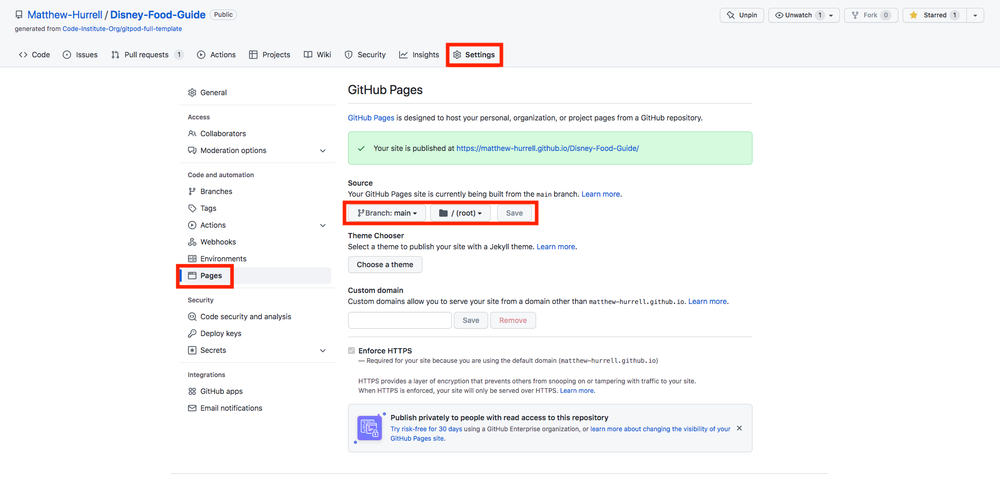

When the site is live, a link to the site can also be found by navigating back to the repository and clicking on the github-pages link under the Environments title menu on the far right side. 

The live link for Disney Food Guide can be found here - [Disney Food Guide](https://matthew-hurrell.github.io/Disney-Food-Guide/)

[Back to top](<#contents>)

## How to fork a repository via GitHub

A copy of a local GitHub repository can be made by forking the GitHub repository. The purpose of this is to allow changes to be made to the copy without affecting the original repository. This is a guide to forking a repository on GitHub.

1. Sign in to GitHub, locate the repository and click to open the repository. 
2. On the right hand side of the repository menu there is a button called fork. Click the button to make a copy of the repository into your GitHub account. 

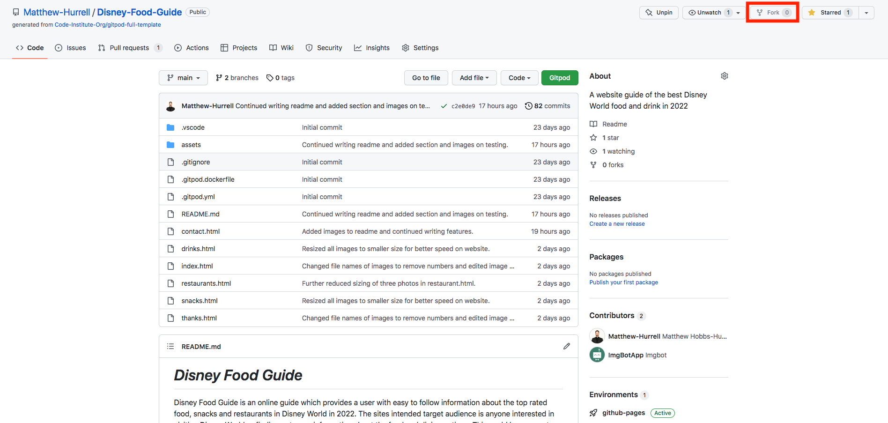

[Back to top](<#contents>)

## How to create a local clone of a project

This is a guide on how to clone a repository from GitHub. 

1. Sign in to GitHub, locate the repository and click to open the repository.
2. On the repository main page, click the code button above where the files are located. This will open a drop down menu.
3. In the dropdown menu stay on the HTTPS option and click the copy icon button next to the URL to copy it. 
4. Now minimise/close your browser and open your local IDE, e.g Visual Studio Code or Brackets.
5. Open Git Bash and change the current working directory to the file location you want the cloned directory to be made in.
6. Type git clone into the command line and then paste the URL copied from GitHub.
7. Press enter and the local repository clone will be created.

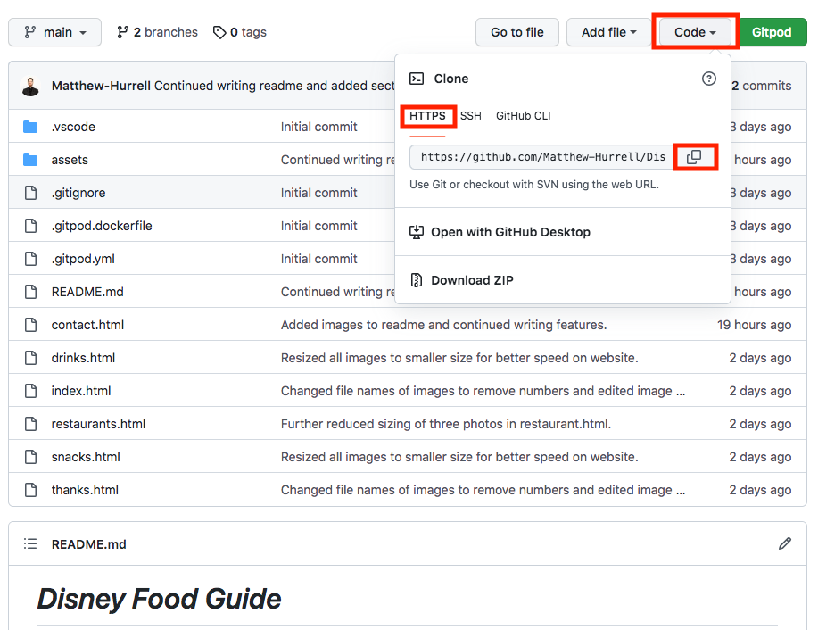

[Back to top](<#contents>)

# Credits

This section will credit the sources of content and media for Disney Food Guide. 

## Content

* Fonts were imported from [Google Fonts](https://fonts.google.com/).
* Icons were imported from [Font Awesome](https://fontawesome.com/).
* Content and information was collated from [The Official Disney Website](https://www.disneyworld.co.uk/) and [Disney Food Blog](https://www.disneyfoodblog.com/).
* The Disney Food Guide colour palate was inspired by [Scheme Colour Classic Disney Colour Scheme](https://www.schemecolor.com/classic-disney.php)
* A tutorial on how to build a reponsive mobile nav menu with CSS and no Javascript was found at [Log Rocket](https://blog.logrocket.com/create-responsive-mobile-menu-with-css-no-javascript/).
* General minor HTML and CSS code tutorials and resources were found at [MDN](https://developer.mozilla.org/en-US/) and [W3Schools](https://www.w3schools.com/). 

## Media

* Images and graphics were used from [The Official Disney Website](https://www.disneyworld.co.uk/) and [Disney Food Blog](https://www.disneyfoodblog.com/).
* Map buttons link to maps found on [The Official Disney Website](https://www.disneyworld.co.uk/).
* Menu buttons link to menus found on [The Official Disney Website](https://www.disneyworld.co.uk/).
* Dining reservation buttons link to [Mouse Watcher](https://mousewatcher.com/).
* The contact page background image was found at [Wall Papers Den](https://wallpapersden.com/disney-the-imagineering-story-wallpaper/1336x768/).

[Back to top](<#contents>)

# Acknowledgements

Disney Food Guide was created as a portfolio 1 project for [Code Insitute](https://codeinstitute.net/), the first of five projects of a Higher Diploma in Full Stack Software Development. I would like to take a moment to thank my mentor [Precious Ijege](https://www.linkedin.com/in/precious-ijege-908a00168/) for all his help and encouragement throughout the development process. I would also like to thank the Slack Community, especially Jim Morel the community executive, for his advice about building a responsive nav using CSS when I was rather lost! I'd like to thank my peers in the May 2022 class at Code Insitute for their feedback and support and also the tutors and student care team at Code Institute. Thank you all for helping me on my journey to becoming a better developer. 

Matthew Hobbs-Hurrell

