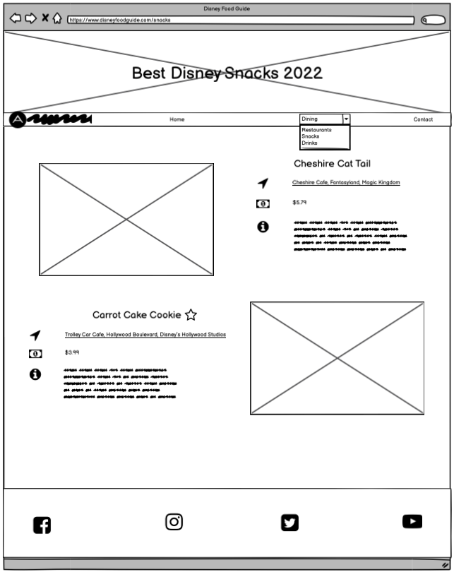
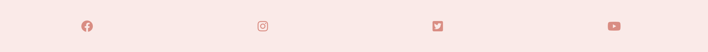
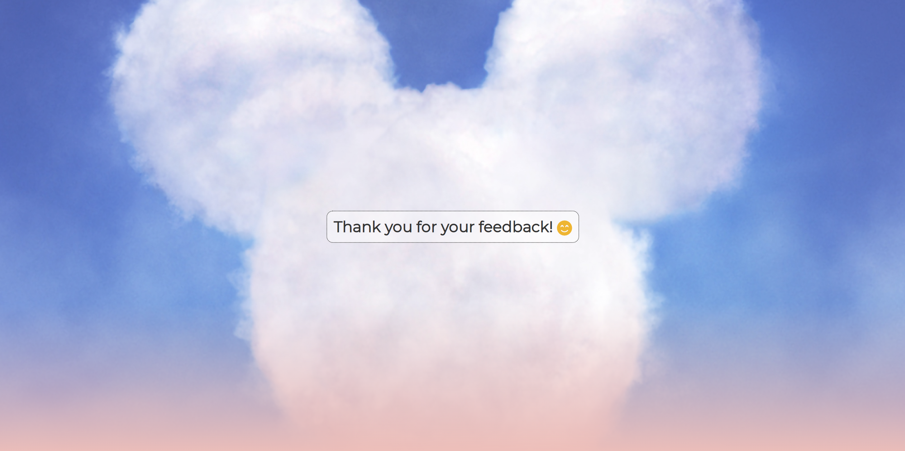

# **_Disney Food Guide_**

Disney Food Guide is an online guide which provides a user with easy to follow information about the top rated food, snacks and restaurants in Disney World in 2022. 
The sites intended target audience is anyone interested in visiting Disney World or finding out more information about the food and dining options. This could be anyone teen and above, male or female. However the majority of the target audience will most likely be young adults or middle aged parents with kids. 
The website is also designed to provide easy navigation to book a table, view the offical menu or find the location of a specific item / restaurant. 

Link to the live site - <a href="https://matthew-hurrell.github.io/Disney-Food-Guide/" target="_blank" rel="noopener">Disney Food Guide</a>

# Contents

* [**User Experience UX**](<#user-experience-ux>)
    * [User Stories](<#user-stories>)
    * [Wireframes](<#wireframes>)
    * [Site Structure](<#site-structure>)
    * [Design Choices](<#design-choices>)
    * [Typography](<#typography>)
    * [Colour Scheme](<#colour-scheme>)
* [**Features**](<#features>)
    * [**Home**](<#home>)
         * [Navigation menu](<#navigation-menu>)
         * [Main Header](<#main-header>)
         * [Introduction](<#introduction>)
         * [Mailing List](<#mailing-list>)
         * [Footer](<#footer>)
    * [**Restaurants**](<#restaurants>)
         * [Header](<#restaurant-header>)
         * [Restaurant Listings](<#restaurant-listings>)
         * [Footer](<#restaurant-footer>)
    * [**Snacks**](<#snacks>)
         * [Header](<#snacks-header>)
         * [Snack Listings](<#snack-listings>)
    * [**Drinks**](<#drinks>)
         * [Header](<#drinks-header>)
         * [Drink Listings](<#drink-listings>)
    * [**Contact**](<#contact>)
         * [Contact Background](<#contact-background>)
         * [Contact Form](<#contact-form>)
    * [**Form Submission Confirmation**](<#form-submission-confirmation>)
    * [**Future Features**](<#future-features>)
* [**Technologies Used**](<#technologies-used>)
* [**Testing**](<#testing>)
* [**Deployment**](<#deployment>)
* [**Credits**](<#credits>)
    * [**Content**](<#content>)
    * [**Media**](<#media>)
*  [**Acknowledgements**](<#acknowledgements>)

# User Experience UX

## User Stories

* As a user I want to be able to fully understand the purpose of Disney Food Guide from the main landing page.
* As a user I want the navigation to be intuitive and easy to understand, with a clear purpose and easy access to information.
* As a user I want to be able to see simple and organised lists with names, prices, descriptions and pictures of each item.
* As a user I want easy links that can lead me off page in a different tab to view the full menu and map locations of each item when applicable. 
* As a user I want to be able to sign up to a mailing list to receive further information and updates from Disney Food Guide direct to my email mailbox.
* As a user I want to be able to contact Disney Food Guide and share my own personal experience at Disney World with pictures if applicable.
* As a user I want to be able to connect with Disney Food Guide through various social media sites quickly and easily.
* As a user I want to see the top recommended restaurants, food and drink and Disney World. 
* As a user I want to be provided with a link to book a table at any of the applicable locations listed on the site.

[Back to top](<#contents>)

## Wireframes 

The project templates and wireframes for Disney Food Guide were designed using [Balsamiq](https://balsamiq.com). The designs vary from the end layout in some places due to creative decisions made throughout the development process.

[Back to top](<#contents>)

## Site Structure 

Disney Food Guide has five pages freely accessable by using the on site navigation. These pages are the [home page](index.html), which is the default loading page, [restaurants](restaurants.html), [snacks](snacks.html), [drinks](drinks.html) and [contact](contact.html). There is one other page which is viewed in response to the contact form submission, that page is [thanks](thanks.html) but this page isn't accessable via the normal site navigation. The navigation bar is present on every page of the website. This nav is replaced by a mobile sticky nav on smaller devices which follows the screen when the user continues down the pages. A back to the top clickable link was added to the longer pages to enable a user to scroll back up to the top of the page without having to manually scroll. This makes accessing the nav bar easier on larger screens. These links disappear on smaller devices as the nav bar is always visible. The logo at the top left of the nav bar can also be used as a link to the home page. There is also a scroll down clickable link box on the home page main header image which provides a visual queue for the user to scroll down to view the welcome text as the main header takes up the entire page. When clicked, this box scrolls the view down to the lower section. This box disappears on smaller devices. 

[Back to top](<#contents>)

## Design Choices 

* ### Typography 

The font family chosen for Disney Food Guide was Montserrat, with a backup font of sans-serif. This font family was used for all text across the site. It was chosen for its professional yet playful feel which is easy to read. It matched well with the lighthearted tone of the content whilst still remaining formal enough to not look unprofessional. The font was selected from [Google Fonts](https://fonts.google.com/). To cut down on load times only font weights of 300 and 400 were chosen. The font was imported using a link in [the CSS document](assets/css/style.css).

* ### Colour Scheme 

The colour scheme used was a variation on the classic Disney colour scheme. Mostly a combination of whites, pinks, blacks and orange yellows with varying degrees of transparency to provide different shades. The text colour is a dark grey so as not to appear to dark. Social media icons transition to their signature colours when hovered over. The light colours throughout the site help to generate a soft and welcoming atmosphere. Orange is a colour of optimism, freedom and youth. Pink is a calm, soft and creative colour. Yellow is a colour often associated with fun, happiness, joy and positivity. Together these colours capture the youthful spirit of Disney. A blue background image is used for the contact page as blue is a colour of trust, confidence and purpose. This may help generate more confidence and trust in the user to submit their details. 

[Back to top](<#contents>)

# Features

Disney Food Guide is designed to make accessing information as easy for the user as possible. There are many user friendly features which are formatted and styled in accordance with best practice. Users will be familiar with the layout and flow of the site as it doesn't stray too far from the expected norm. Friendly and lighthearted content encourages exploration throughout the website. 

## Existing Features

### Home

The home page is the main landing page of Disney Food Guide. It's intent is to provide the user with a purpose for the website and also walk the user through some of the features before encouraging further exploration via the navigation bar.

Link to live site - [Home](https://matthew-hurrell.github.io/Disney-Food-Guide/index.html)

Link to code - [GitHub](https://github.com/Matthew-Hurrell/Disney-Food-Guide/blob/main/index.html)

* ### Navigation Menu 

* Main Nav

The main navigation bar is present at the top of all pages of the site. It features a Disney Food Guide logo on the far left which is a clickable link to the home page. Spanning across from the right of the nav bar is the links to the other pages of the website. When a user hovers over a link to a page a pink underline appears on the bottom. When a user is on one of the pages that underline continually displays beneath whichever page they are on. The page links are evenly spaced using flexbox and respond to changes of screen size. When the screen size goes below 757px this navigation bar is hidden and is replaced with a mobile nav bar.

* Mobile Nav

The mobile nav bar is hidden from view on all screen sizes above 757px. On smaller screens it is visible. The mobile menu is sticky and follows the screen as the user scrolls down. This nav features the same clickable Disney Food Guide Logo on the left side of the bar. On the right side there is a menu icon button that displays a drop down menu of the page links when clicked. The menu icon is removed from display when clicked and is replaced by an icon of a cross to indicate a way of closing the menu. When the cross icon is clicked the drop down menu disappears. The drop down menu doesn't interfere with the flow and layout of information displayed beneath it, it simply appears ontop until closed with the cross icon. This menu can be accessed anywhere on the page. 

* ### Main Header

The main header section features a large background image which takes up the whole height and width of the screen on larger screens. The background image is a collage of multiple items of food and drink at Disney World. This helps the user understand the intention of the site straight away. The image features a white linear gradient which was designed through experimentation in the browser. There is also a h1 title featuring the name of the website and a h2 title below summarising its purpose. Both of these titles are within a pink slightly transparent box to make their visibility better ontop of the background image. There is also a scroll down box with similar styling and an icon with arrows pointing down. This provides a visual indication to the user that there is more information below the header. This box can also be clicked to scroll the user down to the welcome section automatically. As the screen size reduces this section resizes at multiple break points to allow for most of the background image to still be seen. The scroll box is removed from display when the mobile nav bar is introduced and the header section is resized to the point where the information below is visible without having to scroll.

* ### Introduction

Below the header is the welcome section / introductory paragraph. It features a h2 title with a quick welcome and then a paragraph of text below that. The text further establishes the purpose and intention of the site while showing the playful tone of the content. The purpose of this text is to walk the user through the basic features of the site so they have an understanding before then using the navigation bar to travel through the sections. The text is short enough so as not to overload the user with too much information at once. 

* ### Mailing List

On larger screens the mailing list is in a column directly right of the welcome paragraph. This is a form with the intention of allowing a user to submit their details to be kept informed of any further information or updates. It's a simple form with three inputs for first name, last name and email address with a submit button. There is also a h2 title within the form which shows the user its purpose. The form has been formatted to not allow any of these inputs to be left blank without returning a prompt to complete the form fully. The email address input can only be submitted with a valid email address. When the information is submitted the page is simply refreshed. There are also placeholders in the input fields which are filled out with the details of Mickey Mouse. The form compresses and is reponsive on smaller screens and stacks beneath the welcome paragraph. The button changes colours when hovered over and there is a light orange background with a rounded border radius on the form. This is an optional feature for the user.

* ### Footer

The footer element is present at the bottom of every page other than the contact page. The footer has a light pink background and it contains four icons which provide links to facebook, instagram, twitter and youtube. As this site isn't established on social media it simply links to the home pages of each site. The icons are coloured with a darker shade of pink but as they are hovered over by a user they transition into their predefined social media colours. A user should recognise these colours and use them as a visual queue if they are looking for a certain social media site. Generally it is quite common to see social media links in a footer so this will be something the user should be familiar with without much explanation needed. They should also be familiar with the logos without a need for writing their full names. The footer is designed using flexbox and is reponsive with smaller screen sizes and because of its simplicity, doesn't require much editing or resizing. The icons are spaced evenly across the screen using flexbox. 

[Back to top](<#contents>)

### Restaurants

The restaurants page is accessible via the main navigation menu and it's intended purpose is to provide the user with information about the top ten restaurants in Disney World in 2022 in a clear and easy to understand format. 

Link to live site - [Restaurants](https://matthew-hurrell.github.io/Disney-Food-Guide/restaurants.html)

Link to code - [GitHub](https://github.com/Matthew-Hurrell/Disney-Food-Guide/blob/main/restaurants.html)

* ### Restaurant Header

The header for the restaurant page features a cropped version of the background image from the main page, which makes it half the size in height. The same linear gradient is used on the image and the same styling of titles and boxing is used. The title is a h1 and is centered in the middle of the image to clearly display the subject of the page to the user. As the screen size is reduced the background image and titles continue to resize to fit on smaller screens.

* ### Restaurant Listings

This is the main section of the restaurant page. It features ten individual restaurant listings each with a large internal picture, a name, location, dining type, price range and summary. Each listing has a button link to a menu and table booking which opens in a new tab. The location is also a link which opens a new tab to an online virtual map pinpointing the location of the restaurant. On larger screens each listing is laid out in two columns. Each listing alternates between image left and image right to give a balanced flow to the page. Each listing information section features a h2 title with the name of the restaurant at the top. The location, dining type, price range and summary then follow beneath with corresponding icons to easily define the purpose of each piece of information to the user in a clear way. Link buttons are displayed beneath the summary paragraph and feature a similar styling to other buttons throughout the site. Summary paragraph content is kept short to avoid large blocks of text. Each alternate listing features a faint change of background colours to define the different sections whilst not distracting from the content. The text is spaced using flexbox and each listing is also centered in columns using flexbox. As the screen size decreases the content shrinks before stacking ontop as singular columns using the flexbox feature flex-direction column. To reduce the amount of code and to provide a uniform appearance throughout the site, the styling of the listings is recorded using CSS classes for reusable styling throughout the page and in the drinks and snacks pages. Two main classes are used to style all the following listings. Content is spaced out to avoid clutter and to display information in a pleasant and easy to understand way.

* ### Restaurant Footer

The restaurant footer is styled almost exactly the same as the main footer on the main landing page, although it has one extra feature. Because of the page length the footer also features a back to the top link which sends the user smoothly to the top of the page when clicked. This avoids the user having to scroll manually all the way back to the top to reach the navigation bar. This link also features an arrow icon pointing upwards to serve as a visual queue if the user is unsure of its purpose. The link transitions to a darker colour when hovered over. The social media icons are then spaced evenly around the middle link using flexbox. This footer is reused for the snacks and drinks pages. The back to top link is removed from display when the mobile nav bar is visible on smaller screens. As the nav bar is sticky for the mobile display and is visible at all times, there is no need to scroll to the top of the page to navigate the site. This also frees up space in the footer for responsivity on smaller screens. 

[Back to top](<#contents>)

### Snacks

The snacks page is again accessible via the main navigation menu. Its purpose is very similar to the restaurants page except it is providing information on the top ten snacks at Disney World in 2022. Information needs to be arranged in a clear to understand way and styled similarly to the previous pages. 

Link to live site - [Snacks](https://matthew-hurrell.github.io/Disney-Food-Guide/snacks.html)

Link to code - [GitHub](https://github.com/Matthew-Hurrell/Disney-Food-Guide/blob/main/snacks.html)

* ### Snacks Header

The snacks header is styled very similarly to the restaurant header except the difference in title content to showcase the subject and purpose of the page to the user in a clear and defined way.

* ### Snack Listings

The main section of the snacks page is made up of the snack listings. This section comprises of ten individual listings of the top snacks at Disney World in 2022. The same reusable CSS classes from the restaurant listings are used in this section to uniformly order the images and information in a style that will now be familiar to the user. Some information used for the restaurants is inapplicable to the snacks and is removed. Snacks are normally available via couter service throughout the parks and are therefore not available for table bookings, so the booking link button was removed. The dining type was also removed as it is not relevant to the individual items. Icons and colour schemes remain consistent with the other pages of the site. Location and menu links for each item open in a new tab. The images and information shrink on smaller screen sizes and then stack ontop of each other in singular columns using flex-direction column. Images are kept uniform throughout with a clear front shot of each snack item per listing. 

[Back to top](<#contents>)

### Drinks

The drinks page is accessible via the main navigation menu. It's purpose is to define and showcase the top ten drinks at Disney World in 2022. Information is layed out in a format which is very consistent with the other pages in the site. Information should be clear and accurate, and the page should be easy to navigate. 

Link to live site - [Drinks](https://matthew-hurrell.github.io/Disney-Food-Guide/drinks.html)

Link to code - [GitHub](https://github.com/Matthew-Hurrell/Disney-Food-Guide/blob/main/drinks.html)

* ### Drinks Header

The styling for the drinks header is consistent with the previous pages. The h1 title is different to clearly display the subject of the content of the page to the user. 

* ### Drink Listings

The main section of the drinks page is comprised of the drink listings. This section is comprised of ten individual listings of the top drinks at Disney World in 2022. The section uses the same reusable CSS classes from the previous pages to make the information styling consistent with previous pages. A alcoholic / non-alcoholic catagory was added to the drinks listings with a matching martini glass icon as this is a useful piece of information for users who have kids or wish to avoid alcohol. The buttons to book a table and view the menu are displayed and removed from each listing when applicable. Some drinks are only available at kiosks and consequently do not have table reservations. All buttons and location links open in a new tab. The pictures are high quality and of a similar styling to the snack images. Flexbox is used to evenly space content. As with the other pages, the listings are responsive and stack when viewed on smaller screen sizes.  

[Back to top](<#contents>)

### Contact

The purpose of the contact page is to provide a clear to understand and easily accessable form of contact that the user can use to submit details of their own experience at Disney World. This can also help keep information up to date on the website. The page needs to look welcoming and trustworthy to encourage the user to submit their information. This page is accessible via the navigation menu.

Link to live site - [Contact](https://matthew-hurrell.github.io/Disney-Food-Guide/contact.html)

Link to code - [GitHub](https://github.com/Matthew-Hurrell/Disney-Food-Guide/blob/main/contact.html)

* ### Contact Background

The contact page is a simple one form page with a centralised form and a background image covering the entire length and width of the screen. The background image dimensions are defined with vh and vw so they line up with the outer dimensions of the screen on any screen size. The background image is a simple disney themed cloud with a blue colour sky. The image is simple enough not to distract from the form content. The footer is removed from display on the contact page, however there is a linear gradient applied to the bottom of the background image which fades into the colour used for the footer throughout the rest of the site. This helps bring some consistency to the colour scheme in comparison to the other pages in the site.

* ### Contact Form

The form on the contact page is centered in the middle of the screen using flexbox. The background is a transparent white box with a dotted 1px black border which helps provide some clarity of text over the background image. The form features a h2 title prompting the user to submit their information and details about their disney trip. There is a heart icon in the title to encourage positive interaction. The form inputs are split into two columns on larger screens but stack into one column using flexbox on smaller screens. The user has six different inputs for information and data in the form. First name, last name, email address and the description of your trip box are all required inputs, the form will not accept the data without all of them being correctly filled out. Date of trip and the photo attachment inputs are both optional as the user may not remember a date and/or may not have a photo. The form is similarly styled to the mailing list form on the main landing page of the site. Inputs have border radius rounded edges and the same placeholders as the mailing list form. When the form is submitted the user is directed to the thanks.html page which is styled exactly the same way but with a thank you message instead of the form. This is the only way to access the thanks.html page.

### Form Submission Confirmation

The purpose of the form submission / thank you page is to show the user that their form submission has been successfully received. The page should also allow and promote easy navigation away from the page onto another page of the site without the user needing to use the back button on the browser. This page is not accessible via the navigation menu and is hidden until the user submits the contact form. The styling and layout is exactly the same as the contact form page except the form is now removed and replaced with a thank you for your feedback message with similar styling to the form. Contact is still underlined in the navigation bar, which suggests to the user that they are still on the same page. There is also a smily face icon next to the thank you message.

Link to live site - [Thanks](https://matthew-hurrell.github.io/Disney-Food-Guide/thanks.html)

Link to code - [GitHub](https://github.com/Matthew-Hurrell/Disney-Food-Guide/blob/main/thanks.html)

[Back to top](<#contents>)

## Future Features

Disney Food Guide has many potential avenues for expansion. Here are some ideas that could further build upon the site.

* A full blog could be added to the landing page or a seperate blog page. It would be a good place to keep users informed with the latest news and updates about the park and dining options. Further information like articles and videos could be displayed here.
* An e-commerce element could be introduced with the ability for the user to pay a small fee to download a full digital pdf dining guide. 
* Image elements within the lists could be further expanded by adding more images to each item to make a slideshow which the user can browse through. Video could also be included in the slideshow.
* A video guide for each category could be imbedded in the header of each page so the user can click and watch the video guide if they prefer this to reading the guide.
* The site requires an update at least once a year to showcase the new food and drink available at Disney World. Previous lists could be archived and available to view on a seperate page.  

[Back to top](<#contents>)

# Technologies Used

* HTML5 - Provides the structure of the site information, elements and website content. 
* CSS3 - Provides the styling of the HTML content.
* Balsamiq - Wireframing software used to plan and design website templates.
* GitPod - An open source developer platform for remote development. Used to edit and build the website.
* GitHub - An online host for web and software development projects. Used to store the repository and deploy the finished website.
* Affinity Photo - A photo editing app available through the apple store used to design and create graphics for the site.
* Apple Notes - A simple apple app used to write and plan copy and content for the website.
* Slack - An online messaging program designed for workplace collaboration. Used for advice and guidance from peers. 

[Back to top](<#contents>)

# Testing 

# Deployment

# Credits

## Content

## Media

# Acknowledgements

